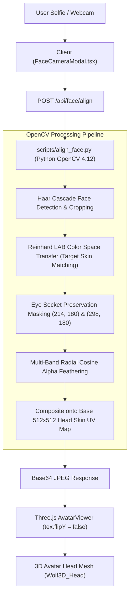

# Face Recognition & Texture Mapping Architecture (`face-recog` Branch)

> **Branch:** `face-recog`  
> **Pull Request:** [https://github.com/disCodeOri/VibeCheck/pull/new/face-recog](https://github.com/disCodeOri/VibeCheck/pull/new/face-recog)

---

## 1. Executive Summary

This branch implements end-to-end real-time face capture, computer vision detection, skin-tone harmonization, and seamless projection onto 3D humanoid avatars (male and female Ready Player Me glTF models) for the **ChicFit Virtual Try-On** feature.

It resolves major computer graphics and photogrammetry challenges when projecting 2D user photographs onto 3D UV unwrapped head meshes:
- **Eliminated "Ghost Eyes"**: Preserved the 3D model's animated eyeballs without 2D photo clash.
- **Eliminated Skin Color Seams**: Harmonized lighting and skin tones using Reinhard $L^*a^*b^*$ color space normalization.
- **Eliminated Rectangular Cutout Edges**: Replaced sharp borders with radial cosine/Gaussian alpha feathering.
- **Fixed glTF UV Inversion**: Handled Three.js texture coordinate mismatch (`flipY = false`).

---

## 2. Architecture & Pipeline



---

## 3. Technical Problems Solved

### A. The "Ghost Double Eyes" Problem
* **Issue**: The Ready Player Me 3D model uses physical spherical meshes (`EyeLeft` and `EyeRight`). When raw selfies with eyes, pupils, or glasses are mapped directly to `Wolf3D_Head`, the 2D photo eyes clash with the 3D eyeballs, producing an uncanny 4-eyed effect.
* **Solution**: Mask coordinates `(214, 180)` and `(298, 180)` on the UV texture are selectively attenuated to low opacity (0.22), allowing the 3D model's clean physical eyes to take precedence.

### B. Skin Tone & Lighting Inconsistencies
* **Issue**: Pasting a selfie directly onto the 3D head created an obvious square patch because the user's camera white balance and skin tone did not match the 3D base texture. Poisson seamless cloning (`cv2.seamlessClone`) failed due to background artifacts bleeding inward.
* **Solution**: Implemented **Reinhard Color Transfer** in $L^*a^*b^*$ color space. Computes the channel-wise means ($\mu$) and standard deviations ($\sigma$) of the avatar's base skin and shifts the photo crop:
  $$\text{Result}_{L,A,B} = (\text{Photo}_{L,A,B} - \mu_{\text{photo}}) \cdot \frac{\sigma_{\text{avatar}}}{\sigma_{\text{photo}}} + \mu_{\text{avatar}}$$

### C. Abrupt Cutout Borders
* **Issue**: Rectangular or hard elliptical borders made the face look like a pasted sticker.
* **Solution**: Radial cosine rolloff from $r=0.60$ to $r=1.00$ combined with a $21 \times 21$ Gaussian blur kernel, melting the user's facial features into the avatar's jaw, cheeks, and forehead.

### D. The Three.js glTF `flipY` Trap
* **Issue**: In Three.js, `TextureLoader` defaults to `flipY = true`, while glTF uses top-left UV coordinates (`flipY = false`). A default texture loaded onto a glTF mesh is vertically inverted, causing the face to project onto the chin/neck.
* **Solution**: Explicitly enforced `tex.flipY = false; tex.needsUpdate = true;` on all dynamic face textures.

---

## 4. File-by-File Changes

### Backend & CV Processing
| File | Action | Description |
|---|---|---|
| [`scripts/align_face.py`](file:///home/ayush/Desktop/VibeCheck/scripts/align_face.py) | **New** | OpenCV Python script for Haar face detection, Reinhard LAB skin tone harmonization, eye socket masking, and cosine alpha feathering. |
| [`server/app.ts`](file:///home/ayush/Desktop/VibeCheck/server/app.ts) | **Modified** | Added `POST /api/face/align` endpoint executing the Python alignment script with base64 request/response. |
| [`server/index.ts`](file:///home/ayush/Desktop/VibeCheck/server/index.ts) | **Modified** | Exported and integrated alignment route handlers. |

### Frontend UI & State Management
| File | Action | Description |
|---|---|---|
| [`src/features/ChicFit.tsx`](file:///home/ayush/Desktop/VibeCheck/src/features/ChicFit.tsx) | **Modified** | Added **👤 My Face** tab, webcam launch trigger, upload button, face clear button, and male/female model toggle. |
| [`src/components/FaceCameraModal.tsx`](file:///home/ayush/Desktop/VibeCheck/src/components/FaceCameraModal.tsx) | **New** | Live webcam modal featuring oval face-alignment guide, 3-second countdown, front/rear camera toggle, and instant preview. |
| [`src/components/AvatarViewer.tsx`](file:///home/ayush/Desktop/VibeCheck/src/components/AvatarViewer.tsx) | **Modified** | Integrated glTF `flipY = false` UV texture handling, dynamic head mesh detection (`Wolf3D_Head`), auto-rotation, and male/female model swapping. |
| [`src/lib/faceTexture.ts`](file:///home/ayush/Desktop/VibeCheck/src/lib/faceTexture.ts) | **New** | Client helper that queries `/api/face/align` with automatic HTML5 Canvas compositing fallback. |
| [`src/lib/api.ts`](file:///home/ayush/Desktop/VibeCheck/src/lib/api.ts) | **Modified** | Added `api.alignFace(image, isMale)` SDK client method. |
| [`src/features/FitCheck3D.tsx`](file:///home/ayush/Desktop/VibeCheck/src/features/FitCheck3D.tsx) | **New** | Extended 3D dressing room with procedural texture synthesis. |
| [`src/lib/textures.ts`](file:///home/ayush/Desktop/VibeCheck/src/lib/textures.ts) | **New** | Procedural denim, plaid, knit, and pattern texture synthesizer for 3D garments. |
| [`src/styles.css`](file:///home/ayush/Desktop/VibeCheck/src/styles.css) | **Modified** | Added camera modal styles, pulsing oval alignment guides, and responsive layout styling. |

### Assets
| Path | Type | Purpose |
|---|---|---|
| `public/models/male_humanoid.glb` | 3D glTF | Male avatar model with UV mapped head and eye nodes. |
| `public/models/humanoid.glb` | 3D glTF | Female avatar model with UV mapped head and eye nodes. |
| `public/models/male_face.jpg` | Texture | Target 512x512 male face base texture for Reinhard LAB transfer. |
| `public/models/female_face.png` | Texture | Target female face base texture for Reinhard LAB transfer. |

---

## 5. API Specification

### `POST /api/face/align`
Aligns and harmonizes a user photograph onto the 3D model UV head map.

**Request Body (`application/json`):**
```json
{
  "image": "data:image/jpeg;base64,...",
  "isMale": true
}
```

**Response (`200 OK`):**
```json
{
  "success": true,
  "faceTexture": "data:image/jpeg;base64,..."
}
```

---

## 6. How to Test

1. Ensure the backend and frontend are running:
   ```bash
   npm run dev
   ```
2. Navigate to: `http://localhost:5173/chicfit`
3. Under the garment selectors, click the **👤 My Face** tab.
4. Click **"Take Selfie"** or upload an image file.
5. The avatar updates immediately with the harmonized face texture mapped cleanly onto the 3D head.
